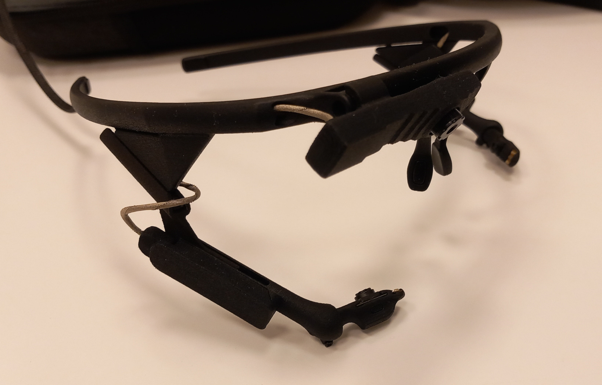
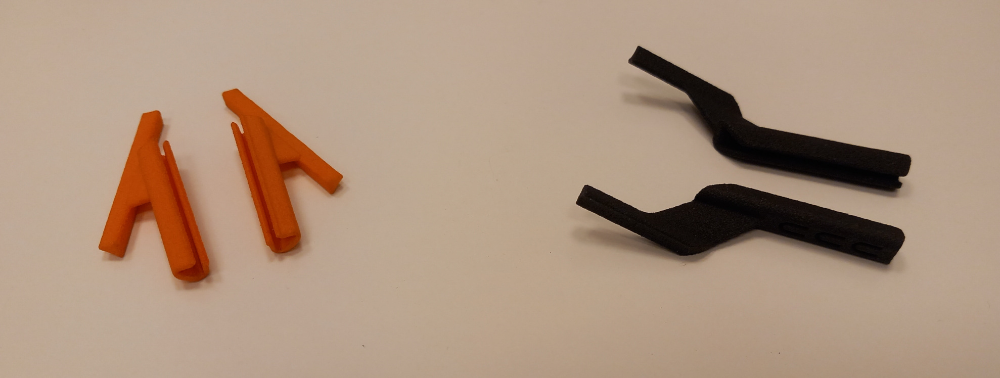
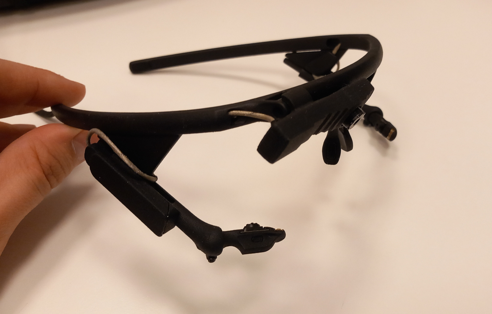
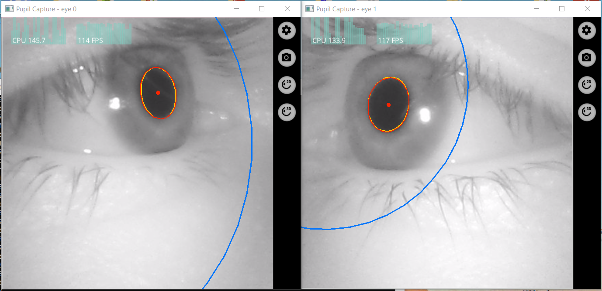
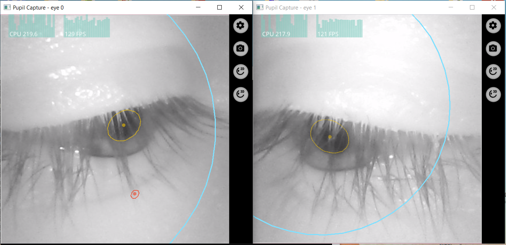
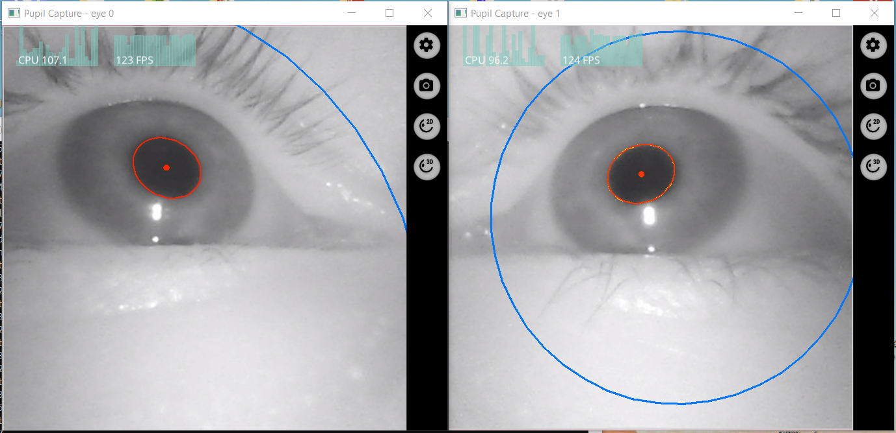
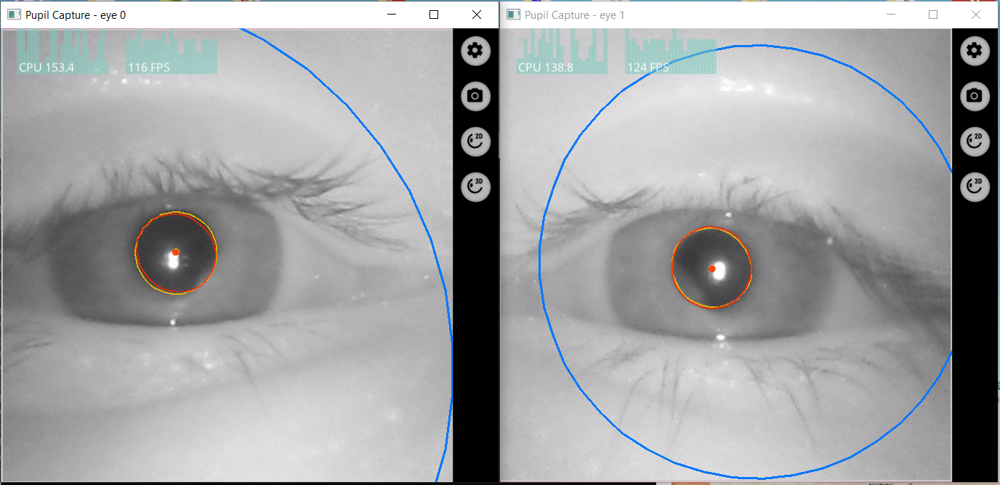

# Camera arm extenders for the Pupil Core head-mounted eye-tracking glasses

***

PupilCoreExtender is a free and open-source SLS 3D printable extender bit alternative for the Pupil Core glasses, to allow more reliable eye-tracking with the device when its user frequently looks downwards.

This is a *non-profit and unofficial, hobby work*, compatible with the Core glasses of Pupil Labs.

Note: I use the device for pupillometry, so I have not thoroughly tested how my extenders change gaze tracking results, but certainly they improve a lot on pupil detection success and pupil data quality.

***

## Introduction

Pupil Core is a cost effective head-mounted eye-tracking capable device, essentially consisting of two tiny NIR illuminators and two cameras, mounted on a blank frame, spiced with a world camera facing to the front.

If you are here owning no Pupil Core at the moment, you definitely need to first check out more recent products from Pupil Labs, as they already are more advanced than the Core, and I recommend buying them instead: https://pupil-labs.com

But if you have a Core and want to improve it, just continue reading on!

The company has released their newer products since the Core, like the Pupil Invisible and its successor Neon, which latter ones offer much more stability. However there are many Pupil Core glasses around the world, still in use or waiting to be used. Moreover, the Core is still (as of 2024 April) on the market officially.

The Pupil Core evidently suffers from a problem that the eye pupils easily get out of the reliable image area when the user looks downwards (e.g. looking on the ground while standing, or looking down on the desk top while sitting at a desk). The unadjustable nose-eyes-height and possible illumination inhomogenities also make it harder for the eye-tracking software to find the pupil and do its work.

The Pupil Core glasses by default come with a pair of orange-coloured extender bits. The point of these is to provide an alternative viewing angle and distance for the eye cameras to have a view on the eyes.

As you might have tried to use the stock pair of extenders, you probably too have come to the conclusion that they could be optimized or improved. Partly because they introduce an angle both horizontally and vertically, but the vertical angle is too small to counteract the distance change from the eye introduced when attached to the frame, ultimately having only a very slight effective improvement relative to the state of the glasses when there are not extenders equipped at all. Also, the original extenders have sticking-out bits that could be spared/cut to optimize the occluded view to the user. To tackle these problems, I made my own extenders, that you can see here.

The below two pictures show a Core glasses device, in its default state, and the same glasses with my extenders equipped:

These extenders can greatly reduce eyelash occlusion and improve pupil visibility for the cameras, if the person tends to look downwards while using the device, or if their nose-height relative to the eyes is different from typical. This is particularly useful for human factors studies, and studies where the material to be acted with, is partly placed on the desk top and the participants are sitting at it throughout the experiment.

The following two pair of screenshots show frames recorded from both eyes while the glasses was in its default state, with the user looking straight ahead to the monitor, and down on the computer keyboard:

The following two pair of screenshots show frames recorded from both eyes, but with my extenders equipped. Again, with the user looking straight ahead to the monitor, and down on the computer keyboard:

***

## The extender 3D models

You can just download the SLS-printable .STL files, and have them printed at any local 3D printing shop that has an SLS-machine, or have the bits ordered from JLCPCB or PCBWay for example, where they should cost no more than 1 USD each, plus VAT and shipping (as of 2025). There is a left and right version, symmetrical. There is no sanding or any additional surface finish needed on the 3D print, only the basic bead blasting that is anyway done by default at the manufacturer to remove leftover powder.

These are the models:

[Right side extender](https://raw.githubusercontent.com/kheki4/PupilCoreExtender/master/support_20deg_R.stl)

[Left side extender](https://raw.githubusercontent.com/kheki4/PupilCoreExtender/master/support_20deg_L.stl)

Imporantly, you need the bits made using stereolitography (SLS) printing, because they are so small, but at the same time need ample stiffness and resistance to mechanical stress, that SLS is highly optimal for producing them. (As you might have noticed, the original Pupil Core is also SLS-printed.)

After you have the bits printed, just slide them on the glasses rails and you are ready to go! 

For me this length was optimal, but if you find them too long, just gently cut off a little from either end, using a utility knife. The amount ultimately depends on your actual needs of typical looking directions. 

You can also find an editable model in the repository, which can be modified in Inventor, if you need so. (It produces a "R" variant when the mirror command at the end is added, and "L" if not added.)

***

## Additional note

Author: Gábor Bényei @ BUTE

License: CC BY-NC-SA

The 3D-printable models used here were created with Autodesk Inventor 2024. The models and any derivative work should be used for non-commercial, research/education purposes only.

